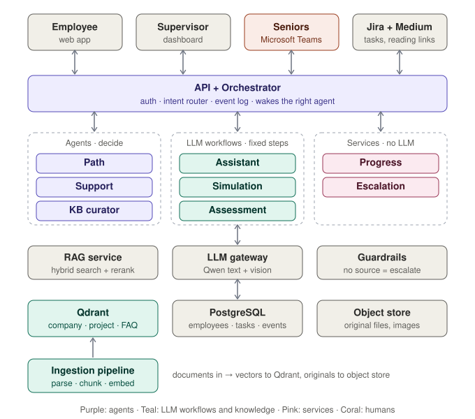

# ContextBridge

**AI-powered technical employee onboarding platform.**

ContextBridge turns onboarding from a static checklist into a personalized, knowledge-aware, measurable 30-day journey:

> Understand → Learn → Practice → Execute → Get support → Assess → Improve → Work-ready

It connects employee information, company knowledge, project context, tasks, practice, assessment and human support in one workflow. The first implementation targets technical and software companies, where new hires must learn not only company policies but also team processes, projects, tools and engineering practices.

---

## Table of contents

1. [The problem](#the-problem)
2. [The solution](#the-solution)
3. [Who it is for](#who-it-is-for)
4. [Architecture type](#architecture-type)
5. [System architecture](#system-architecture)
6. [Agents](#agents)
7. [How agents communicate](#how-agents-communicate)
8. [Knowledge layer](#knowledge-layer)
9. [Escalation and approval flow](#escalation-and-approval-flow)
10. [Metrics and dashboards](#metrics-and-dashboards)
11. [Tech stack](#tech-stack)
12. [End-to-end example](#end-to-end-example)

---

## The problem

- **Fragmented information.** Knowledge is spread across documents, repos, chats, managers and seniors.
- **Repetitive work.** Seniors answer the same setup and process questions for every new hire.
- **No personalization.** A backend developer, a QA engineer and a DevOps engineer get the same checklist.
- **Limited visibility.** Managers cannot see what is done, where the employee is stuck, or what gaps remain.
- **Completion is not readiness.** Finishing documents does not prove the employee can apply them.

## The solution

A multi-agent system that:

- builds a **personalized 30-day path** around four dimensions: *Process*, *Product / Project context*, *Professional expectations*, *Tech stack & tooling*;
- answers questions from **approved company and project knowledge**, with citations;
- gives **practical, role-specific simulations** and assesses understanding;
- tracks **progress, knowledge gaps and blockers** for supervisors;
- **escalates to seniors through Microsoft Teams** when no approved answer exists, and turns every approved answer into reusable knowledge.

The AI supports the new employee. It does **not** replace the buddy, mentor, senior or team lead: it reduces the repeated questions that reach them so they can focus on questions that need experience and judgment.

## Who it is for

| User | What they get |
| --- | --- |
| New employee | Personalized path, contextual answers, help with recurring problems, practice, clear expectations |
| Senior / buddy / mentor | Fewer repeated questions, structured escalations in Teams, one-click approval into the knowledge base |
| Supervisor / team lead | Readiness score, knowledge gaps, blockers, agent performance on one dashboard |
| Organization | Centralized, governed onboarding knowledge that improves with every escalation |

---

## Architecture type

ContextBridge is a **hybrid orchestrated multi-agent system**:

| Pattern | Where it appears | Why |
| --- | --- | --- |
| Supervisor / Router | Intent router + Orchestrator send each chat request to one agent | Chat needs a fast, predictable path |
| Event-driven Blackboard | Agents write events to shared state; the Orchestrator wakes the next agent | The learning loop is long and async; agents stay decoupled |
| Human-in-the-Loop | Escalation → Teams → senior answers → approval | Unverified company facts must be confirmed by a person |
| Agentic RAG | Support decides between approved KB, general LLM and escalation | Retrieval is a decision, not a fixed step |
| Evaluator / Guardrail | Guardrails check answers; Assessment grades as LLM-as-judge | Separates generation from verification |

**Design principle:** in onboarding, predictability and auditability matter more than autonomy. Autonomy is used only where a real decision is needed; everything else is a fixed workflow or plain code, and every step is recorded as an event.

---

## System architecture

| Layer | Components |
| --- | --- |
| Clients and integrations | Employee app, Supervisor dashboard, Senior inbox, Microsoft Teams, Jira, Medium RSS, Scheduler |
| API + orchestration | API gateway (auth, RBAC), Intent router, Orchestrator, Event bus |
| Agents | Path, Assistant, Support, Simulation, Assessment, Progress, KB curator, Escalation |
| AI services | RAG service, Context builder, LLM gateway, Guardrails |
| Data stores | Qdrant, PostgreSQL, Redis, MinIO (object store) |
| Ingestion | Upload → Parse → Structure → Chunk + tag → Embed |
| Ops | Docker Compose, Langfuse, RAGAS, GitHub Actions |

No client or integration talks to an agent directly: everything passes through the API gateway and the orchestrator. Agents never query data stores directly; they go through the shared AI services.

---

## Agents

The agent layer has eight components of three types. Only three are true agents; the rest are fixed LLM workflows or plain services.

| Type | Meaning |
| --- | --- |
| **Agent** | Decides its next step and uses tools in a loop |
| **LLM workflow** | Fixed steps with an LLM call; known input and output |
| **Service** | Plain code, no LLM: rules and calculations |

| Component | Type | Role | Trigger | Emits |
| --- | --- | --- | --- | --- |
| **Path** | Agent | Builds the 30-day plan from role, team, project and experience; re-plans when gaps appear | New employee; `gap.detected` | `path.created` |
| **Assistant** | LLM workflow | Explains onboarding steps, tasks and project concepts from approved KB, with citations | Chat question ("what / how") | answer, `module.done` |
| **Support** | Agent | Resolves problems (setup, access, recurring errors); routes between approved KB, general LLM and escalation | Chat question ("I'm blocked") | solution or `kb.miss` |
| **Simulation** | LLM workflow | Generates role- and project-specific practice scenarios | `module.done` | `sim.answered` |
| **Assessment** | LLM workflow | Grades answers on six dimensions with a rubric (LLM-as-judge) | `sim.answered` | `assessment.scored` |
| **Progress** | Service | Computes readiness, blockers, next milestones and agent metrics | scores, tasks, tickets | `gap.detected`, `readiness.updated` |
| **Escalation** | Service | Creates Teams tickets, deduplicates, routes to owners, enforces SLA | `kb.miss` | `ticket.created`, `blocker.raised` |
| **KB curator** | Agent | Turns senior replies and Problems-channel posts into structured FAQ entries; merges or creates | Senior reply; new post | draft → `answer.approved` |

**Assessment dimensions:** company knowledge, project understanding, technical knowledge, tool familiarity, task understanding, practical application.

---

## How agents communicate

**No agent calls another agent directly.** Each agent reads shared state, does one job and writes one event. The orchestrator decides which agent runs next.

### Three communication modes

1. **Sync (request / response)** — employee asks → intent router picks Assistant or Support → answer returns immediately. The only path where someone waits.
2. **Async (events)** — an agent finishes and writes an event; the orchestrator wakes the next agent in a background worker.
3. **Human (Teams)** — Escalation posts a card → a senior replies → KB curator drafts → a senior approves → `faq_kb`.

### Two loops

- **Learning loop:** `path.created → module.done → sim.answered → assessment.scored → gap.detected → Path` moves the employee from learning to readiness and adapts the path.
- **Knowledge loop:** `kb.miss → Teams → senior answer → approval → faq_kb` turns every unanswered question into knowledge Support can retrieve next time.

### Event contract

| Event | Producer | Consumer | Key payload |
| --- | --- | --- | --- |
| `path.created` | Path | Assistant, Support | tasks, week, four dimensions |
| `module.done` | Assistant / task check | Simulation | module id, topics covered |
| `kb.miss` | Support | Escalation | question, KBs searched, project, role |
| `ticket.created` | Escalation | Progress | ticket id, owner, SLA |
| `answer.approved` | Seniors via KB curator | Ingestion → faq_kb | Q&A, source ticket, approver |
| `sim.answered` | Simulation | Assessment | scenario, answer, rubric |
| `assessment.scored` | Assessment | Progress | six scores, gaps |
| `task.updated` | Jira webhook | Progress | status, delay |
| `blocker.raised` | Escalation | Progress, dashboard | ticket, SLA missed |
| `gap.detected` | Progress | Path | weak dimension, severity |
| `readiness.updated` | Progress | Dashboard | score, blockers, next milestone |

### Rules

- **One owner per field:** only Path writes tasks, only Assessment writes scores, only Progress writes readiness.
- **Events are facts, not commands:** new agents can subscribe without changing existing ones.
- **Loop guard:** `gap.detected` adds at most N remedial tasks per gap.
- **Self-contained events:** every event carries `employee_id`, `role` and `project`.

---

## Knowledge layer

Knowledge lives in four Qdrant collections. Only the first three may answer company or project questions.

| Collection | Content | Approved |
| --- | --- | --- |
| `company_kb` | Policies, engineering guidelines, security, coding standards, SOPs | Yes |
| `project_kb` | Architecture, APIs, databases, dependencies, deployment, conventions, decisions | Yes |
| `faq_kb` | Recurring questions and problems with approved solutions (static seed + senior-approved answers) | Yes |
| `learning_index` | Links and short summaries from Medium RSS tag feeds | **No** — never used as company fact |

### Multimodal ingestion

`Upload (PDF / DOCX / PPTX / images) → Parse (text + visuals) → Structure preservation → Chunk + tag → Embed → Qdrant`

- Originals are kept in the object store so diagrams and images can be shown with their source chunk.
- Chunks carry metadata: `kb_type`, `project`, `role`, `source`, `approved`, `version`, `review_by`.
- Embeddings: jina-clip-v2 (text and images in one vector space) plus BM25 sparse vectors for hybrid search.

### Retrieval

Hybrid search (dense + BM25) → metadata filter by role and project → reranker → context builder (prompt with citations) → LLM gateway → guardrails.

### Knowledge routing and governance

| Question type | Example | Answered from |
| --- | --- | --- |
| General technical | "What does HTTP 401 mean?" | General LLM |
| Company / project specific | "Which authentication service does our project use?" | Approved KB only, with citations |
| Unknown / unverified | "Why did our production deployment fail yesterday?" | Escalation to seniors |

- The general LLM never overrides or invents company-specific information.
- Guardrails block any company fact without a citation from an approved collection and convert it into `kb.miss`.
- Entries past `review_by` are hidden from retrieval until re-confirmed; edits create a new version and the old one is kept for audit only.

---

## Escalation and approval flow

Escalations go to a **Microsoft Teams channel of all seniors**, not to email. Answering unblocks the employee immediately; approval is a separate step that decides whether the answer becomes reusable knowledge.

1. Support finds no approved answer and emits `kb.miss`.
2. Escalation searches open tickets by embedding similarity; a duplicate (≥ ~0.85) subscribes the employee to the existing ticket.
3. A new ticket is created with a context package and posted by the Teams bot as an Adaptive Card.
4. The ticket is routed to the module owner, then the buddy or mentor; if the SLA is missed, the bot @mentions the team lead and `blocker.raised` appears on the dashboard.
5. A senior replies in the card's thread; the employee and all subscribers are notified at once.
6. The senior picks an action: **Approve to KB**, **One-off**, **Reject**, or **Answer was in KB** (counts a false escalation).
7. On approve, the KB curator drafts an FAQ entry (*Problem, Symptoms, Approved solution, Escalation*) for review; low-risk answers can be self-approved, anything touching security, production or policy needs the team lead.
8. The entry is ingested into `faq_kb` with `approved_by`, `version`, `source_ticket`, `project`, `review_by`.

**Context package:** employee, role, project, onboarding day; original question with screenshots or logs; KBs searched with top-3 chunks and confidence; related module or task; number of subscribers.

**Ticket states:** `open → assigned (→ reassigned on SLA miss) → answered → closed_one_off | drafting → in_review → published` (rejected → back to `answered`).

**Problems channel:** team members post real problems they hit while setting up the project. The KB curator structures them into FAQ drafts, seeding `faq_kb` with real data.

> **Copilot Studio** is a possible future option. Teams chats are not currently selectable as a knowledge source in Copilot Studio's knowledge picker, and agents in group or channel chats cannot use knowledge sources that require end-user authentication. The MVP uses its own Teams bot instead.

---

## Metrics and dashboards

**Supervisor dashboard** shows employee readiness (completed / remaining / delayed activities, scores on the six dimensions, knowledge and practical gaps, blockers, readiness score, next milestone) and **agent performance**.

The escalation count alone is misleading: a low count can mean the agent is guessing. It is always read together with answer quality.

| Metric | Definition | Signals |
| --- | --- | --- |
| Escalation rate | Escalations ÷ total questions | Overall KB coverage |
| Escalation by reason | No match / low confidence / out of scope | Where the KB is thin |
| False escalation | Senior clicks "Answer was in KB" | Retrieval problem |
| Missed escalation | Thumbs-down or same question asked again | Agent answered when it should have escalated |
| Time to resolution | `kb.miss` → employee receives answer | Senior load, SLA health |
| KB growth | Escalations that became approved FAQ entries | Knowledge loop is working |
| Repeat topics | Same topic escalated more than once | Specific KB gap |

**Target behaviour:** the escalation rate falls over time while missed escalations stay low — the knowledge base is learning, not the agent guessing.

---

## Tech stack

| Layer | Choice |
| --- | --- |
| Clients | Next.js + Tailwind + shadcn/ui, Recharts; Teams Adaptive Cards |
| API and orchestration | FastAPI + Pydantic, JWT + RBAC, LangGraph, PostgreSQL `events` table + arq (Redis) workers |
| LLM | Qwen 3 (text), Qwen3-VL (images); hosted API for the MVP, vLLM later |
| Embeddings and retrieval | jina-clip-v2, Qdrant BM25 sparse vectors, bge-reranker-v2-m3 |
| Guardrails | Citation check + Pydantic output validation |
| Data | Qdrant, PostgreSQL, Redis, MinIO |
| Integrations | Microsoft 365 Agents SDK Teams bot + Azure Bot registration, Jira REST + webhooks, feedparser (Medium RSS) |
| Ingestion | Docling, Qwen3-VL captions, structure-aware chunking |
| Ops | Docker Compose, Langfuse, RAGAS, GitHub Actions |

---

## End-to-end example

**New junior backend developer, project: Payment Platform**

1. HR creates the profile. **Path** builds a 30-day plan and links practical Jira tasks.
2. Week 1: **Assistant** explains the Git workflow and payment module architecture from `project_kb`, with citations.
3. The local database connection fails. **Support** finds the approved fix in `faq_kb`; no senior needed.
4. The developer asks how refunds handle expired transactions. No approved documentation exists → `kb.miss` → **Escalation** posts a card in the Seniors channel with the Payment module context.
5. A senior answers in the thread and the developer is unblocked. The senior clicks **Approve**; **KB curator** drafts the FAQ entry, the team lead approves it, and it enters `faq_kb`.
6. After the payments module, **Simulation** presents a production API scenario; **Assessment** scores it and finds a gap in error handling.
7. **Progress** emits `gap.detected`; **Path** adds a targeted error-handling task. The supervisor sees readiness, the gap, the resolved blocker and escalation metrics.
